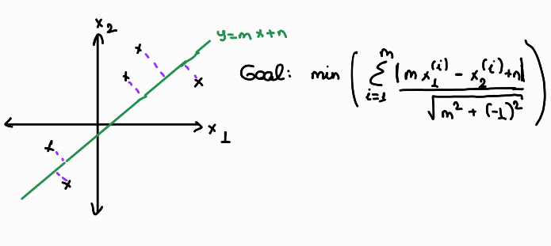

# Chapter 5

## 5.1.1 Vectors

**1. Dot product**

* i.  What’s the geometric interpretation of the dot product of two vectors?

Dot product is used for understanding how much a vector goes along with the direction with another vector.

* ii. Given a vector  u, find vector  v of unit length such that the dot product of  u and  v is maximum.

max u.v where |v| = 1

u.v = |u||v|cos(theta) => max cos(theta) = 1 when theta = 0

then if we select unit vector v on top of vector u we maximize the dot product of two.

max u.v = |u|

**2. Outer product**

* i. Given two vectors  a=[3,2,1] and  b=[−1,0,1] calculate the outer product  aTb? 

a.T = [3,2,1]T    

 b = [-1,0,1]

<a.T,b> = [[-3,0,3],
           [-2,0,2],
           [-1,0,1]]

* ii. Give an example of how the outer product can be useful in ML.

To compute pairwise distance matrix in Simulated Annealing algorithm (ref: https://towardsdatascience.com/outer-products-a-love-letter-b29a2c2c818e)

**3.** What does it mean for two vectors to be linearly independent?

The vector (say) one can not be represented with the vector two ie. no matter how we play around with vector two multiply divide we can not get the vector one. The reverse is also true. We can not get vector two by using linear coefficients and vector one itself.  

**4.** Given two sets of vectors  A=a1,a2,a3,...,an and  B=b1,b2,b3,...,bm. How do you check that they share the same basis?

If they are in the same basis they could be both represented by the basis vectors. The linear combination of the basis vectors should be sufficient to obtain both A & B.

**5.** Given  n vectors, each of  d dimensions. What is the dimension of their span?

To represent d dimensions we have to have d number of linear independent vectors. For example R2 -> (0,1),(1,0). For the scope of this question, if all n vectors are linearly independent then their span is also d dimensions. If not we have to find set basis of these set. The dimension of their spain is wqual to the number of basis vectors we found. 

**6. Norms and metrics**

* i. What's a norm? What is  L0,L1,L2,Lnorm?

Norm is a metric to compute the distantance between two vectors. Norms listed in the question are differ from each other in terms of the way of defining the distance. For example let's take the most common ones. L1 = |x1-x2| & L2 = sqrt{(x1-x2)**2}

* ii. How do norm and metric differ? Given a norm, make a metric. Given a metric, can we make a norm?

The metric d(u,v)
 induced by a vector space norm has additional properties that are not true of general metrics. These are:

**Translation Invariance:** d(u+w,v+w)=d(u,v)

**Scaling Property:** For any real number t, d(tu,tv)=|t|d(u,v).

Conversely, if a metric has the above properties, then d(u,0)
 is a norm.

More informally, the metric induced by a norm "plays nicely" with the vector space structure. The usual metric on Rn has the two properties mentioned above. But there are metrics on Rn that are topologically equivalent to the usual metric, but not translation invariant, and so are not induced by a norm.

(ref: https://math.stackexchange.com/questions/38634/difference-between-metric-and-norm-made-concrete-the-case-of-euclid)

# 5.1.2 Matrices

**1.** Why do we say that matrices are linear transformations?

Definition. A linear transformation is a transformation T : R n → R m satisfying. T ( u + v )= T ( u )+ T ( v ) T ( cu )= cT ( u ) for all vectors u , v in R n and all scalars c .

T(x)=the counter clockwise rotation of x by 90◦.

(ref: https://textbooks.math.gatech.edu/ila/linear-transformations.html#:~:text=come%20from%20matrices.-,Definition,n%20and%20all%20scalars%20c%20.)

Formally to prove a claim is true, we have to use x and y's but for the sake of understanding I will use numerical examples.

v = [[1,1,1],[1,1,1],[1,1,1]]  ; c = 3

3v = [[3,3,3],[3,3,3],[3,3,3]]   {T ( cu )= cT ( u ), the result is the same if we mulptiply elementwise}

u = [2,2,2]

j = [1,1,1]

u+j = [3,3,3] {T ( u + v )= T ( u )+ T ( v ), the result is the same if we sum up the values elementwise}

**2.** What’s the inverse of a matrix? Do all matrices have an inverse? Is the inverse of a matrix always unique?

Let A-1 be the inverse of matrix A. Then <A-1,A> = I. No all the matrix have an inverse (has to be square matrix and det(A) != 0)and the inverse of a matrix does not have to be unique.

**3.**  What does the determinant of a matrix represent?

> *In mathematics, the determinant is a scalar value that is a function of the entries of a square matrix. It characterizes some properties of the matrix and the linear map > represented by the matrix. In particular, the determinant is nonzero if and only if the matrix is invertible and the linear map represented by the matrix is an isomorphism. The > determinant of a product of matrices is the product of their determinants (the preceding property is a corollary of this one). The determinant of a matrix A is denoted det(A), det A, > or |A|*. (https://en.wikipedia.org/wiki/Determinant)

**4.** What happens to the determinant of a matrix if we multiply one of its rows by a scalar ?

Also multiplied with the same scaler. Consider these examples:

 **5.** A  4×4 matrix has four eigenvalues  3,3,2,−1. What can we say about the trace and the determinant of this matrix?

 ****

**6.**Without explicitly using the equation for calculating determinants, what can we say about this matrix’s determinant?

Col1 = Col3*(-0.5); ;No linear independency. Det(A) = 0

**7.** What’s the difference between the covariance matrix  ATA and the Gram matrix  AAT?

****

# 5.1.3 Dimensionality reduction

**1.** Why do we need dimensionality reduction?

* To decrease computational requirements
* To visualize the data

**An important note from Andrew NG:** Don't use dimension reduction for regularization!

**4.** We want to do PCA on a dataset of multiple features in different ranges. For example, one is in the range 0-1 and one is in the range 10 - 1000. Will PCA work on this dataset?

No beacuse PCA algorithm uses distance metrics while converging. If we have predictors having different scales the algorithm won't work properly.

