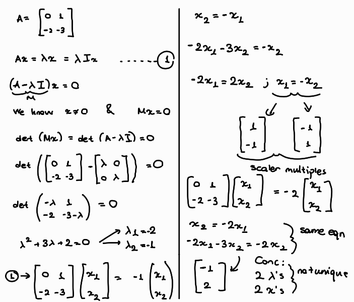
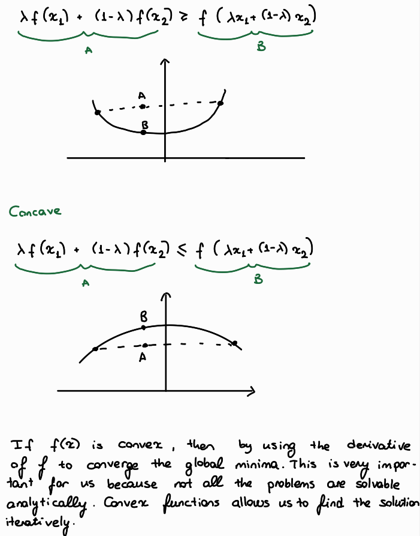
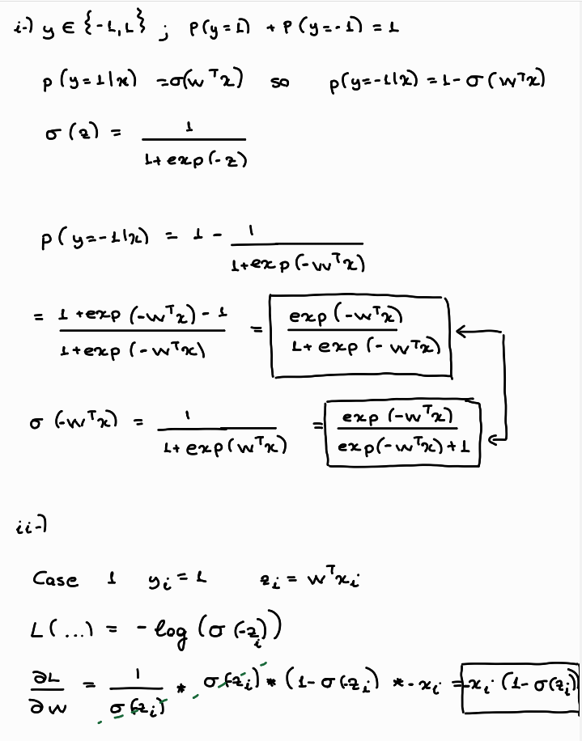
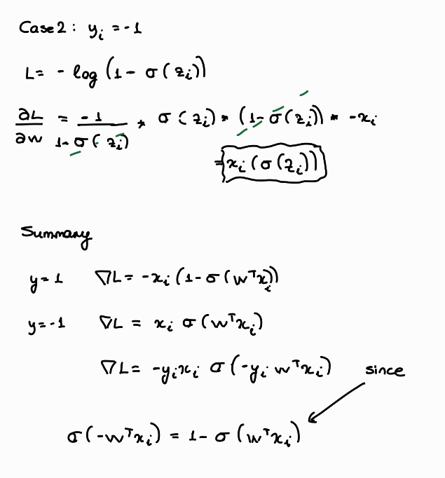
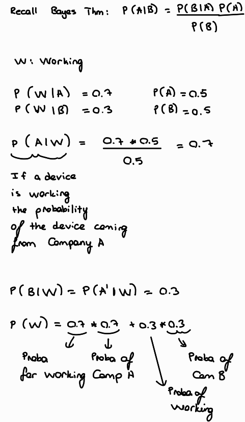
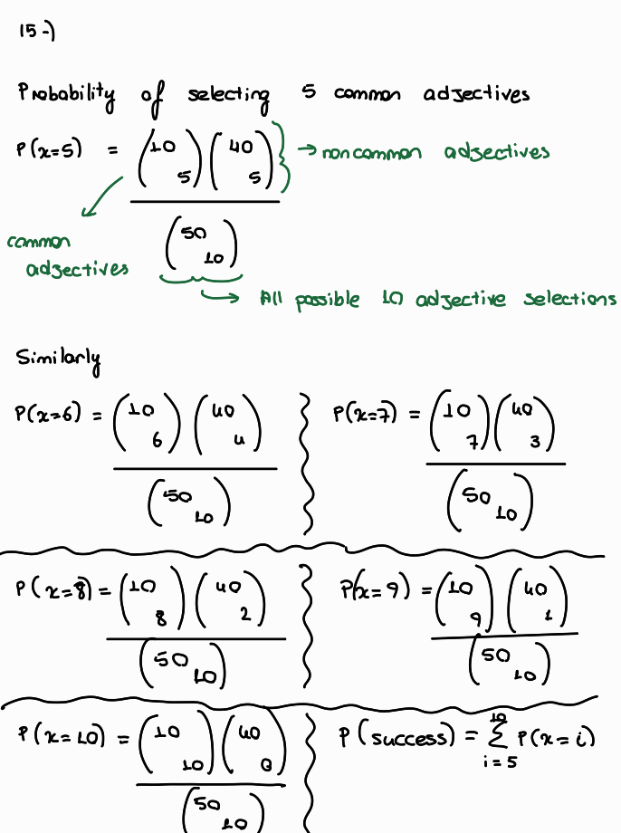
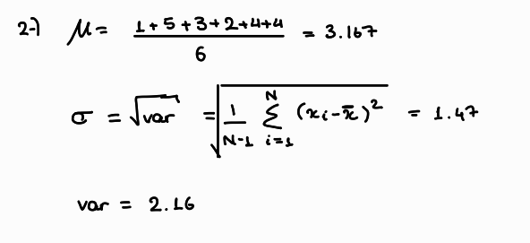

# Chapter 5

## 5.1.1 Vectors

**1. Dot product**

* i.  What’s the geometric interpretation of the dot product of two vectors?

Dot product is used for understanding how much a vector goes along with the direction with another vector.

* ii. Given a vector  u, find vector  v of unit length such that the dot product of  u and  v is maximum.

max u.v where |v| = 1

u.v = |u||v|cos(theta) => max cos(theta) = 1 when theta = 0

then if we select unit vector v on top of vector u we maximize the dot product of two.

max u.v = |u|

**2. Outer product**

* i. Given two vectors  a=[3,2,1] and  b=[−1,0,1] calculate the outer product  aTb? 

a.T = [3,2,1]T    

 b = [-1,0,1]

<a.T,b> = [[-3,0,3],
           [-2,0,2],
           [-1,0,1]]

* ii. Give an example of how the outer product can be useful in ML.

To compute pairwise distance matrix in Simulated Annealing algorithm (ref: https://towardsdatascience.com/outer-products-a-love-letter-b29a2c2c818e)

**3.** What does it mean for two vectors to be linearly independent?

The vector (say) one can not be represented with the vector two ie. no matter how we play around with vector two multiply divide we can not get the vector one. The reverse is also true. We can not get vector two by using linear coefficients and vector one itself.  

**4.** Given two sets of vectors  A=a1,a2,a3,...,an and  B=b1,b2,b3,...,bm. How do you check that they share the same basis?

If they are in the same basis they could be both represented by the basis vectors. The linear combination of the basis vectors should be sufficient to obtain both A & B.

**5.** Given  n vectors, each of  d dimensions. What is the dimension of their span?

To represent d dimensions we have to have d number of linear independent vectors. For example R2 -> (0,1),(1,0). For the scope of this question, if all n vectors are linearly independent then their span is also d dimensions. If not we have to find set basis of these set. The dimension of their spain is wqual to the number of basis vectors we found. 

**6. Norms and metrics**

* i. What's a norm? What is  L0,L1,L2,Lnorm?

Norm is a metric to compute the distantance between two vectors. Norms listed in the question are differ from each other in terms of the way of defining the distance. For example let's take the most common ones. L1 = |x1-x2| & L2 = sqrt{(x1-x2)**2}

* ii. How do norm and metric differ? Given a norm, make a metric. Given a metric, can we make a norm?

The metric d(u,v)
 induced by a vector space norm has additional properties that are not true of general metrics. These are:

**Translation Invariance:** d(u+w,v+w)=d(u,v)

**Scaling Property:** For any real number t, d(tu,tv)=|t|d(u,v).

Conversely, if a metric has the above properties, then d(u,0)
 is a norm.

More informally, the metric induced by a norm "plays nicely" with the vector space structure. The usual metric on Rn has the two properties mentioned above. But there are metrics on Rn that are topologically equivalent to the usual metric, but not translation invariant, and so are not induced by a norm.

(ref: https://math.stackexchange.com/questions/38634/difference-between-metric-and-norm-made-concrete-the-case-of-euclid)

# 5.1.2 Matrices

**1.** Why do we say that matrices are linear transformations?

Definition. A linear transformation is a transformation T : R n → R m satisfying. T ( u + v )= T ( u )+ T ( v ) T ( cu )= cT ( u ) for all vectors u , v in R n and all scalars c .

T(x)=the counter clockwise rotation of x by 90◦.

(ref: https://textbooks.math.gatech.edu/ila/linear-transformations.html#:~:text=come%20from%20matrices.-,Definition,n%20and%20all%20scalars%20c%20.)

Formally to prove a claim is true, we have to use x and y's but for the sake of understanding I will use numerical examples.

v = [[1,1,1],[1,1,1],[1,1,1]]  ; c = 3

3v = [[3,3,3],[3,3,3],[3,3,3]]   {T ( cu )= cT ( u ), the result is the same if we mulptiply elementwise}

u = [2,2,2]

j = [1,1,1]

u+j = [3,3,3] {T ( u + v )= T ( u )+ T ( v ), the result is the same if we sum up the values elementwise}

**2.** What’s the inverse of a matrix? Do all matrices have an inverse? Is the inverse of a matrix always unique?

Let A-1 be the inverse of matrix A. Then <A-1,A> = I. No all the matrix have an inverse (has to be square matrix and det(A) != 0)and the inverse of a matrix does not have to be unique.

**3.**  What does the determinant of a matrix represent?

> *In mathematics, the determinant is a scalar value that is a function of the entries of a square matrix. It characterizes some properties of the matrix and the linear map > represented by the matrix. In particular, the determinant is nonzero if and only if the matrix is invertible and the linear map represented by the matrix is an isomorphism. The > determinant of a product of matrices is the product of their determinants (the preceding property is a corollary of this one). The determinant of a matrix A is denoted det(A), det A, > or |A|*. (https://en.wikipedia.org/wiki/Determinant)

**4.** What happens to the determinant of a matrix if we multiply one of its rows by a scalar ?

Also multiplied with the same scaler. Consider these examples:

 **5.** A  4×4 matrix has four eigenvalues  3,3,2,−1. What can we say about the trace and the determinant of this matrix?

Trace of a matrix = sum of diagonal elements of a matrix = sum of eigenvalues of a matrix

Trace(M) = 3 + 3 + 2 + -1 = 7

det(M) = multipication of eigenvalues

det(M) = 3 * 3 * 2 * -1 = -18

Check out the formulas:

1. https://en.wikipedia.org/wiki/Trace_(linear_algebra)
2. https://en.wikipedia.org/wiki/Determinant

**6.** Without explicitly using the equation for calculating determinants, what can we say about this matrix’s determinant?

Col1 = Col3*(-0.5); ;No linear independency. Det(A) = 0

**7.** What’s the difference between the covariance matrix  ATA and the Gram matrix  AAT?

**8.** Given  A∈Rn×m and  b∈Rn
 
* i. Find  x such that:  Ax=b.

x = Inverse(A)b

* ii. When does this have a unique solution?

If all the coluımns and rows of A (full rank) is a linearly independent square matrix then x is unique.

* iii. Why is it when A has more columns than rows,  Ax=b has multiple solutions?

 Mathematically, more columns than rows means that there are less constraints then variables and we know that if x is a unique m-vector and then A has to have m columns (otwerwise dot product is not possible) and m rows (contraints = variables).

* iv. Given a matrix A with no inverse. How would you solve the equation  Ax=b? What is the pseudoinverse and how to calculate it?

**9.** Derivative is the backbone of gradient descent.

* i. What does derivative represent?

Derivative the the slope a curve at a given point of the curve or more formally:

>In mathematics, the derivative shows the sensitivity of change of a function's output with respect to the input. (ref: https://en.wikipedia.org/wiki/Derivative)

If the behaviour of the curve is dependent on more than one variable (multivariable calculus), we can calculate the sensitivity of that curve with respect to only one variable by using partial derivatives.

* ii. What’s the difference between derivative, gradient, and Jacobian?

The gradient refers to the change in the behavior of a curve with respect to differential changes in all the variables (first partial derivatives for all variables) it depends on. 

The Jacobian is a special kind of matrix that consists of the gradients of multiple functions.

**10.** Say we have the weights  w∈Rd×m and a mini-batch  x of  n elements, each element is of the shape  1×d so that  x∈Rn×d. We have the output  y=f(x;w)=xw. What’s the dimension of the Jacobian  δyδx?

I worked a lot on this question but I couldn't figure a relation. I'll just paste my calculations here.

**11.** Given a very large symmetric matrix A that doesn’t fit in memory, say  A∈R1M×1M and a function  f that can quickly compute  f(x)=Ax for  x∈R1M. Find the unit vector  x so that  xTAx is minimal.

...

# 5.1.3 Dimensionality reduction

**1.** Why do we need dimensionality reduction?

* To decrease computational requirements
* To visualize the data

**An important note from Andrew NG:** Don't use dimension reduction for regularization!

**2.** Eigendecomposition is a common factorization technique used for dimensionality reduction. Is the eigendecomposition of a matrix always unique?

No it is not. Consider these eigenvalue-eigenvector pairs:

**3.** Name some applications of eigenvalues and eigenvectors.

->While taking matrix power.

->As a centrality measure in Network Science (Eigenvector Centrality)

**4.** We want to do PCA on a dataset of multiple features in different ranges. For example, one is in the range 0-1 and one is in the range 10 - 1000. Will PCA work on this dataset?

No beacuse PCA algorithm uses distance metrics while converging. If we have predictors having different scales, the algorithm won't work properly.

**5.** Under what conditions can one apply eigendecomposition? What about SVD?

We can only apply eigendecomposition if the matrix A is diagonizable:

Matrix M is diagonizable if it can be represented as $M = UDU^(-1)$ 

* i. What is the relationship between SVD and eigendecomposition?

SVD is the generalized form of eigendecomposition i.e. SVD can be applied to any matrix, whether it's square or not. 

* What’s the relationship between PCA and SVD?

By using SVD, we can run PCA.

**6.** How does t-SNE (T-distributed Stochastic Neighbor Embedding) work? Why do we need it?

We use t-SNE to dimension reduction purposes. It works like the following:

# 5.1.4 Calculus and convex optimization

**1.** Differentiable functions

* i. What does it mean when a function is differentiable?

Let f be a differable function at R. Then for ∀x in R f'(x) exists.

* ii. Give an example of when a function doesn’t have a derivative at a point.

f(x) = x ∀ x>= 0
f(x) = -x ∀ x<= 0

* iii. Give an example of non-differentiable functions that are frequently used in machine learning. How do we do backpropagation if those functions aren’t differentiable?

ReLU & any form of subgradients. We have to choose a really small step size so that we can converge the optima.

**2.** Convexity
* i. What does it mean for a function to be convex or concave? Draw it.
* ii. Why is convexity desirable in an optimization problem?
* iii. Show that the cross-entropy loss function is convex.

3. Given a logistic discriminant classifier:

p(y=1|x)=σ(wTx)
 
where the sigmoid function is given by:

σ(z)=(1+exp(−z))−1
 
The logistic loss for a training sample  xi
  with class label  yi
  is given by:

L(yi,xi;w)=−logp(yi|xi)
 
Show that  p(y=−1|x)=σ(−wTx)
 
Show that  ΔwL(yi,xi;w)=−yi(1−p(yi|xi))xi
 
Show that  ΔwL(yi,xi;w) is convex.

iii. I've already showed the convexity of loss function.

# 5.1.4 Probability

**1.** Given a uniform random variable in the range of inclusively. What’s the probability that ?

Say the random vairable m found in range n then the probability of m is 1/n.

**2.** Can the values of PDF be greater than 1? If so, how do we interpret PDF?

Yes it could be.

**3.** What’s the difference between multivariate distribution and multimodal distribution?

* Multimodal distribution: A distribution having more than one peaks.
* Multivariate distribution: A distribution depending on multiple predictors.

**4.** What does it mean for two variables to be independent?

It means a change in one is irrelevant for the other.

**5.** It’s a common practice to assume an unknown variable to be of the normal distribution. Why is that?

Gaussian Distribution is easy to interpret and applicable for many cases.

**6.** How would you turn a probabilistic model into a deterministic model?

Select a probability threshold and group the probabilities based on the magnitude comparison between threshold(s) and p_hat. 

**7.** Is it possible to transform non-normal variables into normal variables? How?

Yes. The first example came to my mind is log transform x <- log(x). Another example could be Fisher Transform x <- 0.5*ln((1+x)/(1-x)).

**8.** When is the t-distribution useful?

When the sample size n<30, t-distribution could be useful.

**9.** Assume you manage an unreliable file storage system that crashed 5 times in the last year, each crash happens independently.

* i. What's the probability that it will crash in the next month?

P(crash|month) = 5/12

* ii. What's the probability that it will crash at any given moment?

p(crash|sec) = 5/(12*30*24*3600)

**10.** Say you built a classifier to predict the outcome of football matches. In the past, it's made 10 wrong predictions out of 100. Assume all predictions are made independently., what's the probability that the next 20 predictions are all correct?,

P = (0.9)**20

**11.** Given two random variables  X and Y. We have the values  P(X|Y) and  P(Y) for all values of  X and  Y. How would you calculate  P(X)?

If X and Y are independent then P(X|Y) = P(X)

If not, P(X|Y)*P(Y) =  P(X∩Y); P(X) = ΣP(X|Y=y) * P(Y=y) {for all y∈Y}

**12.** You know that your colleague Jason has two children and one of them is a boy. What’s the probability that Jason has two sons? Hint: it’s not  1/2
 
 Scenarios: BB,GB,GG

 P(at least one boy) = 0.67

 P(BB|at least one boy) = 0.33

**13.** There are only two electronic chip manufacturers: A and B, both manufacture the same amount of chips. A makes defective chips with a probability of 30%, while B makes defective chips with a probability of 70%.

* i. If you randomly pick a chip from the store, what is the probability that it is defective?

P = 0.5 * 0.3 + 0.5 * 0.7 = 0.5

* ii. Suppose you now get two chips coming from the same company, but you don’t know which one. When you test the first chip, it appears to be functioning. What is the probability that the second electronic chip is also good?

**14.** There’s a rare disease that only 1 in 10000 people get. Scientists have developed a test to diagnose the disease with the false positive rate and false negative rate of 1%.

* i. Given a person is diagnosed positive, what’s the probability that this person actually has the disease?

* ii. What’s the probability that a person has the disease if two independent tests both come back positive?

**15.** A dating site allows users to select 10 out of 50 adjectives to describe themselves. Two users are said to match if they share at least 5 adjectives. If Jack and Jin randomly pick adjectives, what is the probability that they match?

**16.** Consider a person A whose sex we don’t know. We know that for the general human height, there are two distributions: the height of males follows  hm=N(μm,σ2m)and the height of females follows  hj=N(μj,σ2j). Derive a probability density function to describe A’s height.

*****

# 5.2.2 Stats

**1.** Explain frequentist vs. Bayesian statistics.

Frequenistics argue that events are relevant to frequencies. Given the model, how does outcome change?

* They utilize likelihoods.

Bayesians claim that events are about beliefs. Given the data, how does model varies? 

* They utilize Bayes Theorem and prior probabilities to compute posterior probabilities.

**2.** Given the array  [1,5,3,2,4,4] find its mean, median, variance, and standard deviation.

**3.** When should we use median instead of mean? When should we use mean instead of median?

When the distribution is skewed, the mean losses it's interpretability. Consider power law distributions. Mean means almost nothing in that case. Median is a lot better metric.

The median losses its interpretability when the data is not ordered or the gap between the values are too much. In these kind of scenarios, the median is a better choice.

**4.** What is a moment of function? Explain the meanings of the zeroth to fourth moments.

0th moment is 1 (referes to total probability) and fourth moment is kurtosis. The moments are used for interpreting distances from a reference point (0). Each moment is defined as Σx**moment_number/n in crude form. 

To eliminate the effect of previous moments, we generally substract the previous moments from the crude forms. Finally we standardize the results and get 1,mean,variance,skewness,kurtosis.

**5.** Are independence and zero covariance the same? Give a counterexample if not.

Coveraience is about linear independency on the other hand independency does not have to be linear. Any non linear relationship can given as an example.

y = x**2

**6.** Suppose that you take 100 random newborn puppies and determine that the average weight is 1 pound with the population standard deviation of 0.12 pounds. Assuming the weight of newborn puppies follows a normal distribution, calculate the 95% confidence interval for the average weight of all newborn puppies.

n = 100 mu = 1 std = 0.12. CI = xbar +- z*std/sqrt(n)
                              = 1 +- 1.96(0.12/sqrt(100)) =  (0.97,1.02)

A small reminder: 95% confidence interval (0.975 quartile) has a z score of 1.96.

**7.** Suppose that we examine 100 newborn puppies and the 95% confidence interval for their average weight is pounds. Which of the following statements is true?

* i. Given a random newborn puppy, its weight has a 95% chance of being between 0.9 and 1.1 pounds. -> False. CI does not tells an expectation about a single sample.
* ii. If we examine another 100 newborn puppies, their mean has a 95% chance of being in that interval. -> True. This is the multiple sample varsion of i. CI tells that I'm confident that average weight of multiple samples lies within 0.97,1.02 range.
* iii. We're 95% confident that this interval captured the true mean weight. ->True. From the definition of Central Limit Theorem.

**8.** Suppose we have a random variable supported on from which we can draw samples. How can we come up with an unbiased estimate of the median of ?

*****

**9.** Can correlation be greater than 1? Why or why not? How to interpret a correlation value of 0.3?

No it couldn't. Correlation coefficient ranges between [-1,1]. While negative correlation indicating a negative relationship between random variables, positive correlation does the reverse. 0.3 correlation indicates a weak positive relationship between two random variables.

**10.** The weight of newborn puppies is roughly symmetric with a mean of 1 pound and a standard deviation of 0.12. Your favorite newborn puppy weighs 1.1 pounds.
* i. Calculate your puppy’s z-score (standard score).

z = (1.1-1)/0.12 = 0.83

* ii. How much does your newborn puppy have to weigh to be in the top 10% in terms of weight?

From Z-table 1.28 Captures 0.8997 of the population. ~1.1536 pounds

* iii. Suppose the weight of newborn puppies followed a skew distribution. Would it still make sense to calculate z-scores?

No because all the arguments related with CI becomes wrong.

**11.** Tossing a coin ten times resulted in 10 heads and 5 tails. How would you analyze whether a coin is fair?

15 trials are too less to conclude something. I would repeat many more experiments then decide whether the coin is fair or not.

**12.**

* i. How do you assess the statistical significance of a pattern whether it is a meaningful pattern or just by chance?

By utilizing p-value

* ii. What’s the distribution of p-values?

*****

* iii. Recently, a lot of scientists started a war against statistical significance. What do we need to keep in mind when using p-value and statistical significance?

****

**13.** 

* i. What happens to a regression model if two of their supposedly independent variables are strongly correlated?

Multicolinearity. Since the variables are strongly correlated their coefficients lose thier interpretability. Furthermore the model becomes too unstable meaning that it becomes very sensitive to minor changes.

* ii. How do we test for independence between two categorical variables?

Chi-squared Test 

* iii. How do we test for independence between two continuous variables?

Checking whether the correlation is close to zero or not

**14.** A/B testing is a method of comparing two versions of a solution against each other to determine which one performs better. What are some of the pros and cons of A/B testing?

**Pros:**

* Test whether an innovative idea works or not

* Allows optimizing one step a time

**Cons:**

* Takes lots of resources and time

* Works only when we are testing a *spesific* goal.

(ref: https://www.experienceux.co.uk/ux-blog/the-pros-and-cons-of-ab-testing/)

**17.** Imagine that you have the prices of 10,000 stocks over the last 24 month period and you only have the price at the end of each month, which means you have 24 price points for each stock. After calculating the correlations of 10,000 * 9,9992 pairs of stock, you found a pair that has the correlation to be above 0.8.

* i. What’s the probability that this happens by chance?

Two hypothesis:

H0: The correlation found is not statistically significant.
H1: The correlation found is real.

t-stat for correlation coefficient: t = r sqrt((n-2)/(1-r**2)) ; dof = n-2 for t-stat

r = 0.8; n = 24; dof = 24-2 = 22; t = 0.8sqrt(22/(1-0.8**2)) = 6.353

We have to use two tailed t test because we want to test the value in two ways {<0.8 & > 0.8}

from t table alpha = 2.07 < 6.353 so the result is statistically siginificant.

The probability of H0 is true is extremely low.

