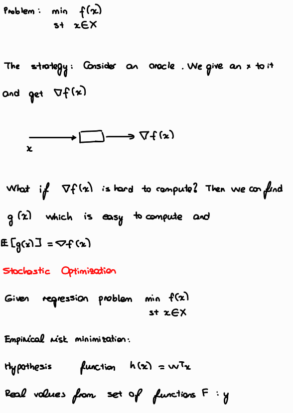
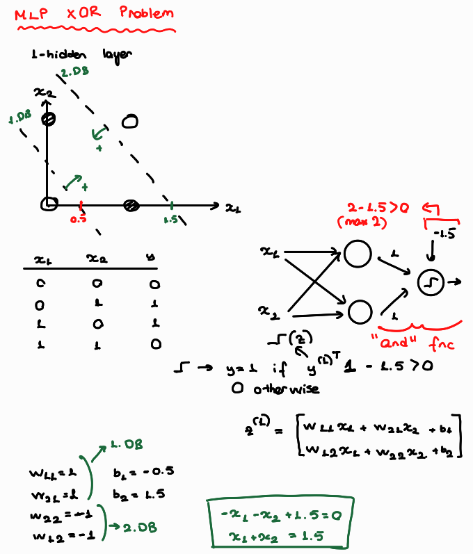

# 8.1.2 Questions

**1.** What are the basic assumptions to be made for linear regression?

* The data is normally distibuted.

Ideally,

* Predictors are not correlated.
* Each data point is equally significant.

**2.** What happens if we don’t apply feature scaling to logistic regression?

If we use gradient descent,

Assume the vector space is in 2-D. If we does not scale thew predictors and there is a scale difference between those two, the contours looks like an amplified ellipse. The direction of the movement (opposite direction to the steepest descent) won't be towards the minima. That's why we observe some zig-zags. On the other hand, if we scale the features, the contour lines look like a circle. In that case, the direction of the movement always show the global minima.


If we use analytical methods,

The coefficients assigned to each predictor become too different from each other. Therefore, the interpretability decreases. Independent from this, the model won't be trained optimally when the scales are not matching (remember regularizers use distances).

**3.** What are the algorithms you’d use when developing the prototype of a fraud detection model?

Autoencoders, clustering algorithms, isolation forests

**4.**

* i. Why do we use feature selection?

-> Reduced required memory (due to eliminating unnecesary predictors)

-> Increased training speed (less computational requirement)

-> Increased model performance (ml models utilize only relevant features during training)

-> Reduced overfitting (Irrelevant features might causes th ml model to overfit)

* ii. What are some of the algorithms for feature selection? Pros and cons of each.

-> Tree algorithms: Resistant to scale differences. Able to capture **non-linear** realtionships. Prone to overfitting.

-> Linear models: Simple. Prone to underfitting. LASSO can be used for feature selection (makes the coefficients of the irrelevant features 0)

-> Variance inflation factor (to decrease predictor relevancies). Only considers linear relationships.

**5.** 

* i. How would you choose the value of k?

-> **Elbow method:** We have to get get the most bang for our buck i.e. when distortion descrease becomes marginal then we need to stop to increase k.

-> **Sector requirements:** Production availability, customer response etc.

* ii. If the labels are known, how would you evaluate the performance of your k-means clustering algorithm?

By comparing the clustering results with true labels.

* iii. How would you do it if the labels aren’t known?

-> Dimension reduction (if necessary) and visualization. In this way I also can decide which clustering algorithm is appropriate for this spesific case.

-> Look at the distortion measure (we can use silhouette score as well). If increasing k still has a potential to deduce the distortion **significantly**, then I increase it. The opposite is true while decreasing the number of k.

* iv. Given the following dataset, can you predict how K-means clustering works on it? Explain.

No it's not going to work. DBSCAN would perform lot better. K-means will not perform the best in cyclic datasets. The distance between data points is minimized when the data has a spherical shape. Therefore in a non-sperical geometry, K-means can not perform well.

**6.**

* i. How would you choose the value of k?

Empirically. We have to find a balance between overfitting (small k) and underfitting (large k).

* ii. What happens when you increase or decrease the value of k?

**Decreasing k:** Model becomes more sensitive to any neighbor of the data point in consideration. This is a good thing up to a point. We wan't to prioritize the nearest neighbors while assigning the labels. However, this can quickly lead to overfitting. Considering more neighbors can make the model more robust.

**Increasing k:** Model considers more neighbors while assigning the label of the data in consideration. This make the mdoel more resiliant to noises (little changes with no importance)

* iii. How does the value of k impact the bias and variance?

Increasing k increases bias (more error) but decreases variance (less sensitive). Decreasing k has an opposite impact on the model.

**7.**

* i. Compare the two.

-> Gaussian Mixture Model (GMM) utilizes Gaussian Distribution to cluster (probablilistic) the data points whereas K-Means utilizes distance metrics (deterministic).

-> GMM assumes the data is normally distributed. K-Means assumes the data is spherical.

-> GMM support covariances for vairety of geometrical shapes (spherical,diagonal,tied and full covariance).

-> GMM needs sufficient amount of data to form clusters whereas K-Means can work even in very small data.

* ii. When would you choose one over another?

-> If the data distibution is close (overlapping clusters), K-Means can be inferior to detect the boundaries. GMM is a better choice in this case. 

-> If computational resouces are limited or the clusters have well defined boundaries, use K-Means.

**8.**

* i. What are some of the fundamental differences between bagging and boosting algorithms?

**Boosting**

-> Sequential Learning (Each learner learns the error of the previous learner.)

-> Increases variance reduces bias

-> Requires relatrively weak learners

**Bagging**

-> Simultaneous learning

-> Reduces the variance (might increase bias)

-> Learners can be weak or strong

* ii. How are they used in deep learning?

-> Tensorflow supports tree algorithm - NN connection. We can use Gradient Boosted trees or Random Forest as the head of our NN structure.

-> Creatively we can build some bagging and boosting structures with multiple NN models (This could be computationally heavy).
 
**9.**

* i. Construct its adjacency matrix.


* ii. How would this matrix change if the graph is now undirected?


* iii. What can you say about the adjacency matrices of two isomorphic graphs?

Since the number of verticies, edges and connectivities are the same among these two the adjency matricies could be transformed to each other by reordering the rows or the columns.


**10** Imagine we build a user-item collaborative filtering system to recommend to each user items similar to the items they’ve bought before.

* i. You can build either a user-item matrix or an item-item matrix. What are the pros and cons of each approach?

User-item matrix is more powerful in recommendation but the memory requirement of this matrix is also can be really big especially if there are lots of customers. Item-item matrix on the othr hand is lot more memory friendly, however it is not customer spesific i.e. treats all the customers the same and this may not be optimal.

* ii. How would you handle a new user who hasn’t made any purchases in the past?

Trust the prior knowledge obtained form customers similar to the new user.

**11.**Is feature scaling necessary for kernel methods?

Yes. Consider SVM. It constructs the decision boundaries based on distances. Therefore on a disproportional space, it's decision boundary assignments wouldn't be accurate.


**12.** Naive Bayes classifier.

* i. How is Naive Bayes classifier naive?

The algorithm directly assumes that all the predictors are conditionally independent from each other.

P(y|x1,x2) = P(y|x1) * P(y|x2)

* ii. Let’s try to construct a Naive Bayes classifier to classify whether a tweet has a positive or negative sentiment. We have four training samples


Tweet	                              Label

This makes me so upset	              Negative

This puppy makes me happy	          Positive

Look at this happy hamster	          Positive

No hamsters allowed in my house	      Negative

According to your classifier, what's sentiment of the sentence `The hamster is upset with the puppy?`


**13.** Two popular algorithms for winning Kaggle solutions are Light GBM and XGBoost. They are both gradient boosting algorithms.

* i. What is gradient boosting?

Graident boosting is a sequential learning technique in which each weak learner learns and possible corrects the errors made by the previous tree. The equation,

F_n+1(x) = F_n(x) - eta * yhat_n(x)

The biggest difference of Gradient Boosting from AdaBoost is that weak learners of a GB model is more advanced (not decision stumps).

* ii. What problems is gradient boosting good for?

In my experience GB outperforms most of the other ml algorithms when data is tabular and the data is not too big. Luckily novadays, both tree algorithms support GPU usage and parallel computing. (I found **Dask** to be more user friendly)

**14.** SVM

* i. What’s linear separation? Why is it desirable when we use SVM?

It means the decision boundary is a line (2D) or a hyperplane (+2D). It is desirable because linear decision boundaries are more straightforward to compute and useful when there is not a sufficient amount of data (KNN lies on the opposite side, the more data the better, slower computation)

* ii. How well would vanilla SVM work on this dataset?

-> Really nicely. Even hard margins can handle this separation

-> Good enough. One outlier point is not sufficient for SVM to fail. Especially by using soft margins we can accomplish sweet results.

-> Not good. SVM overwhelms a lot because the clusters are overlapping and there are outliers for each cluster.


# 8.2.1 Natural language processing


**1.** RNNs

* i. What’s the motivation for RNN?

Recurrent Neural Networks are degined to learn the sequential data like time series, text data etc. The math is:


* ii. What’s the motivation for LSTM?

LSTM is designed for dealing with the vanishing gradient problem occuring in RNN. The math of VGB in RNN is:


Vanihing gradient problem occurs as the model continues to learn due to stack of tanh'.

* iii. How would you do dropouts in an RNN?

WE can apply dropouts to input and output layer of RNN. However applying dropout to a hidden state is a bit tricky. Lets look at mathematically:


2. What’s density estimation? Why do we say a language model is a density estimator?

Density estimation is an attempt for estimating a distribution using a parametric or non parametric methods.

**Parametric method:** We use a function to capture the patterns data points form. This is fast, but requires a prior geometric shape assumption (like sperical). 

-> Assume a shape

-> Find the best parameter combination to represent the data (like mean and variance)

**Nonparametric method:** We use data points themselves to create the density estimation (like in the KNN Classification). We don't have to have a geometric shape assumption but since we use data points themselves, we need sufficient amount of data. Moreover this process is slower and not as efficient.

-> Separate the data into small bins.

-> Combine the bins.


A language model prdicts the the outcome word probability distribution based on the data it gets.

I -> am

  -> belive

  -> do

I am 
    -> happy

    -> tired

    -> a


**3.** Language models are often referred to as unsupervised learning, but some say its mechanism isn’t that different from supervised learning. What are your thoughts?

Based on the word set it gets, a language model tries to predict the next word. This is similar to the supervised learning where for each instance the model predicts a label. For the language models, each instance is the updated word set like the example above. On the other hand, it is understandable to assign the language models in unsupervised learning category because they don't require any labels to train with.

**4.** Word embeddings.

* i. Why do we need word embeddings?

Alternatively, we can use OHE for tokenization. The problem of this approach is that the vocabulary matrix can grow really easily on relatively long texts. Due its sizes this sparse matrix is really hard to work on. That's why we are using word embeddings.

* ii. What’s the difference between count-based and prediction-based word embeddings?

Prediction-based word embeddings include **context** (like Word2Vec) whereas count-based embeddings only considers the counts of a word (like TF-IDF).

* iii. Most word embedding algorithms are based on the assumption that words that appear in similar contexts have similar meanings. What are some of the problems with context-based word embeddings?

A word may have more than one meaning. To solve this problem, we have to approach this problem more seriously. The assumption is a bit naive.

**5.** Given 5 documents:
 D1: The duck loves to eat the worm
 D2: The worm doesn’t like the early bird
 D3: The bird loves to get up early to get the worm
 D4: The bird gets the worm from the early duck
 D5: The duck and the birds are so different from each other but one thing they have in common is that they both get the worm

* i. Given a query Q: “The early bird gets the worm”, find the two top-ranked documents according to the TF/IDF rank using the cosine similarity measure and the term set {bird, duck, worm, early, get, love}. Are the top-ranked documents relevant to the query?

TF

* Bird: D2,D3,D4,D5
* Duck: D1,D4,D5
* Worm: D1,D2,D3,D4,D5
* Early: D2,D3,D4
* Get: D3,D4,D5
* Love: D1,D3

D3 is the most relevant because it contains early,worm,get,bird. Similarly D2 ranks the second. Yes D2 and D3 are relevant with Query.

* ii. Assume that document D5 goes on to tell more about the duck and the bird and mentions “bird” three times, instead of just once. What happens to the rank of D5? Is this change in the ranking of D5 a desirable property of TF/IDF? Why?

Since TF increases it's rank also increases. Although the intention is good, the fact that an irrelevant addition of a word to a document increases it's ranking, this could be somewhat misleading.

**6.** Your client wants you to train a language model on their dataset but their dataset is very small with only about 10,000 tokens. Would you use an n-gram or a neural language model?

I would prefer n-grams because the Neural Language Models require lots of words to perform thier best. Moreover, starting with a simple model is always a good choice due to its low memory and computational requirements.

# 8.2.2 Computer vision

**1.** For neural networks that work with images like VGG-19, InceptionNet, you often see a visualization of what type of features each filter captures. How are these visualizations created?

Hint: check out this Distill post on Feature Visualization.


**2.** Filter size.

* i. How are your model’s accuracy and computational efficiency affected when you decrease or increase its filter size?

Increased filter size:

->The models ability to capture more complex patterns increases. 

->Becomes more prone to overfitting.

-> If the model has not overfitted then accuracy increases. The opposite happens otherwise.

-> The computational requirements increases.

Decreased filter size:

->The models ability to capture more complex patterns decreases. 

->Becomes more prone to underfitting.

-> If the model has overfitted then accuracy increases. The opposite happens otherwise.

-> The computational requirements decreases.


* ii. How do you choose the ideal filter size?

Empirically. It is always a good idea to start small.

**3.** Convolutional layers are also known as “locally connected.” Explain what it means.

Convolutional layers are different from the Fully Connected Neural Network (FFN) layers. In FFN layers as the name suggests all the nodes are connected to each other among two subsequent layers. In CNN architecture the connected nodes are responsible from a local region. (If they are not processing the same part of an image then they are not connected)

**4.** When we use CNNs for text data, what would the number of channels be for the first conv layer?

**5.** What is the role of zero padding?

The filter size is constant. When we use strides with the filters the outer most pixels will be processed lot less compared to the ones in the middle. Thats why we're using zero paading. This way we attempt to solve this problem.

**6.** Why do we need upsampling? How to do it?

Upsampling is needed in AutoEncoders. We capture the most important information (or reduce the dimension) of an image, then to revert it back to its original size, we need to upsample.

-> Nearest Neighbour upsampling

-> Bilinear Interpolation

**7.** What does a 1x1 convolutional layer do?

1x1 convolution (pointwise convolution) is used for changing the 3rd dimension (# of filters) of a CNN architeture. Together with the depthwise convolution, researchers created the model called MobileNet. Thanks to these two properties, MobileNet works really efficiently (small to no loss in accuracy while saving lots of computational resources).

Here are the visual explanation and mathematics (my notes from Andrew NG's CNN Class):


**8.** Pooling.

* i. What happens when you use max-pooling instead of average pooling?

Given the window size nxn when we apply max-pooling the output becomes max(values in nxn matrix). If we use average pooling then we get avg(values in nxn matrix)

* ii. When should we use one instead of the other?

Except the exceptional cases, the max-pooling gives allows us to get more accurate results.

* iii. What happens when pooling is removed completely?

Pooling is a downsampling method so if we remove it then the downsampling process won't be accomplished

* iv. What happens if we replace a 2 x 2 max pool layer with a conv layer of stride 2?

The commputational requirements increases since conv layer does matrix multipications and contains learnable parameters (max-pooling does not).

`Output dim = (F-N+2P)/S + 1` formula still applies so output dimension remains the same.

The model might not capture the most important pattern(s) in given local region.

9. When we replace a normal convolutional layer with a depthwise separable convolutional layer, the number of parameters can go down. How does this happen? Give an example to illustrate this.

# 8.3 Training neural networks

**1.** When building a neural network, should you overfit or underfit it first?

I would underfit the first and increase the model complexity if necessary.

**2.** Write the vanilla gradient update.

Xt+1 = Xt - eta * ∇f(Xt)

**3.** Neural network in simple Numpy.
* i. Write in plain NumPy the forward and backward pass for a two-layer feed-forward neural network with a ReLU layer in between.

Forward Pass:

    z1 = <w1,x>.............z1 = np.dot(w1,x)

    y1 = ReLU(z1)...........y1 = np.maximum(z1,0)

    z2 = <w2,y1>............z2 = np.dot(w2,y1)

    y2 = ReLU(z2) ..........y2 = np.maximum(z2,0)


Backward Pass:

     ∂L/∂wi = ∂L/∂y2* ∂y2/∂z2 * ∂z2/∂y1 * ∂y1/∂z1 * ∂z1/∂wi

     #MSE as loss fnc
     L = 0.5(y2-y)**2
     ∂L/∂y2 = y2-y

     #ReLU Derivative
     ∂y2/∂z2 = (z2>0).astype(float) # 1 in positive 0 in negative
     
     ∂z2/∂y1 = w1

    #ReLU Derivative
     ∂y1/∂z1 = (z1>0).astype(float)

     ∂z1/∂wi = xi

Lets combine all these on Python

```python
import numpy as np

def forward_pass(w1, w2, x):
    z1 = np.dot(w1, x)
    y1 = np.maximum(z1, 0)
    z2 = np.dot(w2, y1)
    y2 = np.maximum(z2, 0)
    
    return y1, y2, z1, z2

def backward_pass(y2, y, z1, z2, w2, x):
    # MSE as loss function
    L = 0.5 * (y2 - y)**2
    dldy2 = y2 - y
    # ReLU Derivative
    dy2dz2 = (z2 > 0).astype(float) 
    dldz2 = dldy2 * dy2dz2
    
    dz2dy1 = w2
    dldy1 = np.dot(dz2dy1.T, dldz2)
    # ReLU Derivative
    dy1dz1 = (z1 > 0).astype(float)
    dldz1 = dldy1 * dy1dz1
    
    dldw1 = np.outer(dldz1, x)
    dldw2 = np.outer(dldz2, y1)
    
    return dldw1, dldw2
```


* ii. Implement vanilla dropout for the forward and backward pass in NumPy.

```python
def forward_pass_with_dropout(w1, w2, x, dropout_rate):
    keep_prob = 1 - dropout_rate
    mask1 = np.random.choice([0, 1], size=len(x), p=[dropout_rate, keep_prob])
    z1 = np.dot(w1, x * mask1)
    y1 = np.maximum(z1, 0)
    
    mask2 = np.random.choice([0, 1], size=y1.shape[0], p=[dropout_rate, keep_prob])
    y1 *= mask2
    z2 = np.dot(w2, y1)
    y2 = np.maximum(z2, 0)
    
    return y1, y2, z1, z2, mask1, mask2

def backward_pass_with_dropout(y2, y, z1, z2, w2, x, mask1, mask2):
    # MSE as loss function
    L = 0.5 * (y2 - y)**2
    dldy2 = y2 - y
    # ReLU Derivative
    dy2dz2 = (z2 > 0).astype(float) 
    dldz2 = dldy2 * dy2dz2
    
    dz2dy1 = w2
    dldy1 = np.dot(dz2dy1.T, dldz2) * mask2  
    # ReLU Derivative
    dy1dz1 = (z1 > 0).astype(float)
    dldz1 = dldy1 * dy1dz1
    
    dldw1 = np.outer(dldz1, x * mask1)  
    dldw2 = np.outer(dldz2, y1)
    
    return dldw1, dldw2
```

**4.** Activation functions.

* i. Draw the graphs for sigmoid, tanh, ReLU, and leaky ReLU.


* ii. Pros and cons of each activation function.

**Sigmoid**
* Good for binary classification and calculating binary probabilities.
* Easy to take derivate (p(1-p)).
* The derivatives near to saturation points are really small therefore it results in Vanishing Gradient Problem (VGB) if it is used sequentially.

**ReLU**
* Introduces nonlinearity to the system easily.
* Not prone to VGB.
* Improves performance when it is used in hidden layers.
* Can result dead neuron problem.

**tanh**
* Good for binary classification
* Ranges from -1 to 1
* Prone to VGP

**Leaky ReLU**
* It has all the pros of ReLU.
* Due to small slope in the negative region, it does not result in dead neuron problem.

* iii. Is ReLU differentiable? What to do when it’s not differentiable?

At x = 0 it is not differable (subgradient). Therefore we use subdifferentials at x = 0. We either treat as x>0 or x<0

* iv. Derive derivatives for sigmoid function when is a vector.


**5.** What’s the motivation for skip connection in neural works?

By using residual connections, we can prevent vanishing gradient problem to occur.


**6.** Vanishing and exploding gradients.

* i. How do we know that gradients are exploding? How do we prevent it?

When the gradient are exploding generally the learning curve becomes significantly unstable. When we plot the learning curves and observe big zigzags then we can suspect that the exploding gradient problem takes in place.

Another way to detect exploding graident problem is observing lots of `NaN` during training process.

Exploding gradients can be solved by  scaling the input data (min-max scaling an be a good choice because NN models does not accept negative inputs) or scaling the hidden layer outputs (Batch Normalization or Layer Normalization can be really useful in that case)

* ii. Why are RNNs especially susceptible to vanishing and exploding gradients?


**7.** Weight normalization separates a weight vector’s norm from its gradient. How would it help with training?

If the weight vector is in check during the training process then exploding or vanishing gradient problems won't occur. Moreover, our graidents will be in a similar scle resulting in a lot more stable training.


**8.**When training a large neural network, say a language model with a billion parameters, you evaluate your model on a validation set at the end of every epoch. You realize that your validation loss is often lower than your train loss. What might be happening?

-> If the validation set is small enough the errors can be monitored higher or lower than it actually is.

-> Dropout or data augentation techniques make the training process harder. However they are not applied during evaluation of the validation set. This may be the cause of this problem.


**9.** What criteria would you use for early stopping?

I would use validation loss because training loss will continusly drop due to overfitting as the training process continues. We have to monitor something else

**10.** Gradient descent vs SGD vs mini-batch SGD.

Gradient descent is a method for optimizing functions that are hard to caluclate it's optima analytically. We can conduct this process in several ways. Full batch gradient descent,computes the gradients for each instance and updates the parameters based on the average value. SGD does the same thing but considering only one randomly selected sample. Finally mini-batch gradient descent applies GD somewhere in between. If we compare these;

**Full Batch GD:** Accurate, slow, computationally heavy

**SGD** Fast, unstable, computationally light

**Mini-batch GD** Somewhere in between

The mathematics of SGD:




**11.** It’s a common practice to train deep learning models using epochs: we sample batches from data without replacement. Why would we use epochs instead of just sampling data with replacement?

If we sample with replacement the model reinforces what it's learned even if it's wrong and some of the instances won't be selected for training. The mathematics:


**12.** Your model’ weights fluctuate a lot during training. How does that affect your model’s performance? What to do about it?

Consider a FFN having equal w matrix in each layer. We don't use any activation functions for the convenience:

zi = output at layer i

Assume i is the last layer. Then,

y = zi = <w^i,x>

If |w|>1 then y will be too large therefore ∂L/∂y will be large. This big graident forces w to switch to a opposite direction a lot. In second iteration a similar gradient having opposite direction occur and this process continues (the model diverges). You can think about this as a ball in a convex region fluctuates left and right continously.

What to do?

* Use regularization so that thwe weigths will always be in check.
* Use an adaptive learning rate. Start fast and gradually slow down if necessary.

**13.** Learning rate.

i. Draw a graph number of training epochs vs training error for when the learning rate is too high, too low,acceptable.


What’s learning rate warmup? Why do we need it?

Consider gradient update:

Wt+1 = Wt - eta * ∇f

We started with random initialization so that our weights are not the same and they are small. If eta is big and the gradient is big enough then updated W quickly changes a lot. Therefore we need to decrease the learning rate unitl it becomes stable. To prevent this to happen besides the adaptive learning rate, we use learning rate warmup. In this way we make sure that any part of the training does not become unstable while using higher learning rates. In warmup phase we gradiually increase the learning rate. Then if necessary, we drop the learning rate until the model converges.


**14.** Compare batch norm and layer norm.

->BatchNorm applies vertical normalization whereas layer normalization applies horizontal normalization.

->BatchNorm is dependent on Batches, layer norm does not.

The mathematics:


**15.** Why is squared L2 norm sometimes preferred to L2 norm for regularizing neural networks?

The derivative of squared L2 norm is easier to compute and defined everywhere. 


**16.** Some models use weight decay: after each gradient update, the weights are multiplied by a factor slightly less than 1. What is this useful for?

This is useful for preventing weights to explode. Results in more stable training and acts like a L2 Norm.

**17.** It’s a common practice for the learning rate to be reduced throughout the training.

* i. What’s the motivation?

Big learning rates are fast and robust to local minima however it is also prone to diverge the gradient descent.

Small learning rates are slow not resistant to local minima but it is great to find the fine tune the minima.

We want to get the benefits of two. Thats why we're implementing changing learning rates. 

* ii. What might be the exceptions?

If eta is already optimal applying this procedure is not beneficial.

**18.** Batch size.

* i. What happens to your model training when you decrease the batch size to 1?

-> The epochs finish really quickly.

-> The learning path could include much more zig-zags.

-> The memory requirements of this process decrerases.

* ii. What happens when you use the entire training data in a batch?

-> The epochs take more time

-> The memory requirements increases.

-> The learning path expected to be more smooth.

* iii. How should we adjust the learning rate as we increase or decrease the batch size?

Learning rate should be decreased when a smaller batch size is used. In this way we can reduce the probability to diverge due to instability. Opposite is true for increased batch size.


**19.** Why is Adagrad sometimes favored in problems with sparse gradients?

Now, first look at the update rule of AdaGrad:

w_t+1,i = w_t,i - eta/sqrt(alpha_t + epsilon)

where 

alpha_1 =  (∂L/∂w1)**2

alpha_2 = (∂L/∂w1)^2 + (∂L/∂w2)^2

alpha_3 = (∂L/∂w1)^2 + (∂L/∂w2)^2 + (∂L/∂w3)^2  {keeps getting bigger, decreases eta more and more}

when given w is sparse, then the update will be occur on a higher eta allowing the model utilize sparse variables more effectively. On the other hand, if the reverse happens, eta keeps getting smaller so more fine tuned approach is adopted. 

Note that AdaGrad could stop learning before reaching global optima.


**20.** Adam vs. SGD.
 
* i. What can you say about the ability to converge and generalize of Adam vs. SGD?

ADAM optimizer is a really successfull optimization algorithm compared to its relatives. Therefore, I'll use my vote for ADAM optimizer. More technically, ADAM uses weight decay and momentum at the same time. The added properties of ADAM makes it robust to hard paths i.e. the convergence probability is higher.

* ii. What else can you say about the difference between these two optimizers?

SGD in default settings, does not use momentum. It also does not uses weight decay.

**21.** With model parallelism, you might update your model weights using the gradients from each machine asynchronously or synchronously. What are the pros and cons of asynchronous SGD vs. synchronous SGD?

ASGD

**Pros:** Fast computing

**Cons:** The asynchron nature results in old and new gradients to occur. Since not all the updates are based on the most recent one this can make model to stale.

SSGD

**Pros:** Slower computing. Each worker has to wait until all of them become ready.

**Cons** More stable gradient update


**22.** Why shouldn’t we have two consecutive linear layers in a neural network?

Consider two linear layers

z1 = <w,x>

z2 = <w,z1>

If |w| > 1 then z2 becomes large. This results in instability.

On the other hand, if we use ReLU nonlinearity some of the neurons will close, resulting in  a lot smaller z2. Therefore the model can capture more complex patterns.

**23.** Can a neural network with only RELU (non-linearity) act as a linear classifier?

If we are creative enough, we can build a linear threshold classifier using ReLU nonlinearity. The last layer should contain ReLU and threshold function f:

Class 1 if z>0

Class -1 otherwise

**24.** Design the smallest neural network that can function as an XOR gate.



**25.** Why don’t we just initialize all weights in a neural network to zero?

If we use zero-initialization, the gradients of all wi will be the same resulting in poor learning.

**26.** Stochasticity.

* i. What are some sources of randomness in a neural network?

-> Random initialization

-> Dropout

-> Stochastic Gradient Descent

-> Zero-meaned Gaussian Noise

* ii. Sometimes stochasticity is desirable when training neural networks. Why is that?

All the randomness decrease the risk of overfitting or neuron dependence.

**27.** Dead neuron.

* i. What’s a dead neuron?

When all the graidents related to a neuron become zero, the neuron won't be updated during the training process. This is called the dead neuron problem.

* ii.  How do we detect them in our neural network?

* iii. How to prevent them?

Dead neuron problem occurs mostly due to the negative part of the ReLU. We can use another varient of ReLU (like leaky one) or completely another nonlinearity (like Swish).

**28.** Pruning.

* i. Pruning is a popular technique where certain weights of a neural network are set to 0. Why is it desirable?

The goal of this process is to maintain accuracy of the network while increasing its efficiency. This can be done to reduce the computational resources required to run the neural network.

ref: https://en.wikipedia.org/wiki/Pruning_(artificial_neural_network)#:~:text=In%20the%20context%20of%20artificial,network%20while%20increasing%20its%20efficiency.

* ii. How do you choose what to prune from a neural network?

A basic algorithm for pruning is as follows:

1. Evaluate the importance of each neuron.
2. Rank the neurons according to their importance (assuming there is a clearly defined measure for "importance").
3. Remove the least important neuron.
4. Check a termination condition (to be determined by the user) to see whether to continue pruning.

ref: https://en.wikipedia.org/wiki/Pruning_(artificial_neural_network)#:~:text=In%20the%20context%20of%20artificial,network%20while%20increasing%20its%20efficiency.


**29.** Under what conditions would it be possible to recover training data from the weight checkpoints?

If the model overfitted, by reverting the learning we can recover most of the training data. For example if w is square and we have no activations and the model memorized the training data, then 

changing y = w.x to x = w^-1.y helps us to recover the training data. 

**30.** Why do we try to reduce the size of a big trained model through techniques such as knowledge distillation instead of just training a small model from the beginning?

Some of the times small models are not suitable becuase they underfit a lot. Instead of risking this especially if we have enough memory and computational resources, we can use more complex models and try to simplify their learning process.