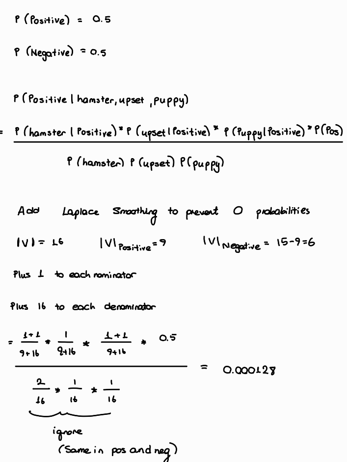

# 8.1.2 Questions

**1.** What are the basic assumptions to be made for linear regression?

* The data is normally distibuted.

Ideally,

* Predictors are not correlated.
* Each data point is equally significant.

**2.** What happens if we don’t apply feature scaling to logistic regression?

If we use gradient descent,

Assume the vector space is in 2-D. If we does not scale thew predictors and there is a scale difference between those two, the contours looks like an amplified ellipse. The direction of the movement (opposite direction to the steepest descent) won't be towards the minima. That's why we observe some zig-zags. On the other hand, if we scale the features, the contour lines look like a circle. In that case, the direction of the movement always show the global minima.

If we use analytical methods,

The coefficients assigned to each predictor become too different from each other. Therefore, the interpretability decreases. Independent from this, the model won't be trained optimally when the scales are not matching (remember regularizers use distances).

**3.** What are the algorithms you’d use when developing the prototype of a fraud detection model?

Autoencoders, clustering algorithms, isolation forests

**4.**

* i. Why do we use feature selection?

-> Reduced required memory (due to eliminating unnecesary predictors)

-> Increased training speed (less computational requirement)

-> Increased model performance (ml models utilize only relevant features during training)

-> Reduced overfitting (Irrelevant features might causes th ml model to overfit)

* ii. What are some of the algorithms for feature selection? Pros and cons of each.

-> Tree algorithms: Resistant to scale differences. Able to capture **non-linear** realtionships. Prone to overfitting.

-> Linear models: Simple. Prone to underfitting. LASSO can be used for feature selection (makes the coefficients of the irrelevant features 0)

-> Variance inflation factor (to decrease predictor relevancies). Only considers linear relationships.

**5.** 

* i. How would you choose the value of k?

-> **Elbow method:** We have to get get the most bang for our buck i.e. when distortion descrease becomes marginal then we need to stop to increase k.

-> **Sector requirements:** Production availability, customer response etc.

* ii. If the labels are known, how would you evaluate the performance of your k-means clustering algorithm?

By comparing the clustering results with true labels.

* iii. How would you do it if the labels aren’t known?

-> Dimension reduction (if necessary) and visualization. In this way I also can decide which clustering algorithm is appropriate for this spesific case.

-> Look at the distortion measure (we can use silhouette score as well). If increasing k still has a potential to deduce the distortion **significantly**, then I increase it. The opposite is true while decreasing the number of k.

* iv. Given the following dataset, can you predict how K-means clustering works on it? Explain.

No it's not going to work. DBSCAN would perform lot better. K-means will not perform the best in cyclic datasets. The distance between data points is minimized when the data has a spherical shape. Therefore in a non-sperical geometry, K-means can not perform well.

**6.**

* i. How would you choose the value of k?

Empirically. We have to find a balance between overfitting (small k) and underfitting (large k).

* ii. What happens when you increase or decrease the value of k?

**Decreasing k:** Model becomes more sensitive to any neighbor of the data point in consideration. This is a good thing up to a point. We wan't to prioritize the nearest neighbors while assigning the labels. However, this can quickly lead to overfitting. Considering more neighbors can make the model more robust.

**Increasing k:** Model considers more neighbors while assigning the label of the data in consideration. This make the mdoel more resiliant to noises (little changes with no importance)

* iii. How does the value of k impact the bias and variance?

Increasing k increases bias (more error) but decreases variance (less sensitive). Decreasing k has an opposite impact on the model.

**7.**

* i. Compare the two.

-> Gaussian Mixture Model (GMM) utilizes Gaussian Distribution to cluster (probablilistic) the data points whereas K-Means utilizes distance metrics (deterministic).

-> GMM assumes the data is normally distributed. K-Means assumes the data is spherical.

-> GMM support covariances for vairety of geometrical shapes (spherical,diagonal,tied and full covariance).

-> GMM needs sufficient amount of data to form clusters whereas K-Means can work even in very small data.

* ii. When would you choose one over another?

-> If the data distibution is close (overlapping clusters), K-Means can be inferior to detect the boundaries. GMM is a better choice in this case. 

-> If computational resouces are limited or the clusters have well defined boundaries, use K-Means.

**8.**

* i. What are some of the fundamental differences between bagging and boosting algorithms?

**Boosting**

-> Sequential Learning (Each learner learns the error of the previous learner.)

-> Increases variance reduces bias

-> Requires relatrively weak learners

**Bagging**

-> Simultaneous learning

-> Reduces the variance (might increase bias)

-> Learners can be weak or strong

* ii. How are they used in deep learning?

-> Tensorflow supports tree algorithm - NN connection. We can use Gradient Boosted trees or Random Forest as the head of our NN structure.

-> Creatively we can build some bagging and boosting structures with multiple NN models (This could be computationally heavy).
 
**9.**

* i. Construct its adjacency matrix.

* ii. How would this matrix change if the graph is now undirected?

* iii. What can you say about the adjacency matrices of two isomorphic graphs?

Since the number of verticies, edges and connectivities are the same among these two the adjency matricies could be transformed to each other by reordering the rows or the columns.

**10** Imagine we build a user-item collaborative filtering system to recommend to each user items similar to the items they’ve bought before.

* i. You can build either a user-item matrix or an item-item matrix. What are the pros and cons of each approach?

User-item matrix is more powerful in recommendation but the memory requirement of this matrix is also can be really big especially if there are lots of customers. Item-item matrix on the othr hand is lot more memory friendly, however it is not customer spesific i.e. treats all the customers the same and this may not be optimal.

* ii. How would you handle a new user who hasn’t made any purchases in the past?

Trust the prior knowledge obtained form customers similar to the new user.

**11.**Is feature scaling necessary for kernel methods?

Yes. Consider SVM. It constructs the decision boundaries based on distances. Therefore on a disproportional space, it's decision boundary assignments wouldn't be accurate.

**12.** Naive Bayes classifier.

* i. How is Naive Bayes classifier naive?

The algorithm directly assumes that all the predictors are conditionally independent from each other.

P(y|x1,x2) = P(y|x1) * P(y|x2)

* ii. Let’s try to construct a Naive Bayes classifier to classify whether a tweet has a positive or negative sentiment. We have four training samples

Tweet	                              Label

This makes me so upset	              Negative

This puppy makes me happy	          Positive

Look at this happy hamster	          Positive

No hamsters allowed in my house	      Negative

According to your classifier, what's sentiment of the sentence `The hamster is upset with the puppy?`

**13.** Two popular algorithms for winning Kaggle solutions are Light GBM and XGBoost. They are both gradient boosting algorithms.

* i. What is gradient boosting?

Graident boosting is a sequential learning technique in which each weak learner learns and possible corrects the errors made by the previous tree. The equation,

F_n+1(x) = F_n(x) - eta * yhat_n(x)

The biggest difference of Gradient Boosting from AdaBoost is that weak learners of a GB model is more advanced (not decision stumps).

* ii. What problems is gradient boosting good for?

In my experience GB outperforms most of the other ml algorithms when data is tabular and the data is not too big. Luckily novadays, both tree algorithms support GPU usage and parallel computing. (I found **Dask** to be more user friendly)

**14.** SVM

* i. What’s linear separation? Why is it desirable when we use SVM?

It means the decision boundary is a line (2D) or a hyperplane (+2D). It is desirable because linear decision boundaries are more straightforward to compute and useful when there is not a sufficient amount of data (KNN lies on the opposite side, the more data the better, slower computation)

* ii. How well would vanilla SVM work on this dataset?

-> Really nicely. Even hard margins can handle this separation

-> Good enough. One outlier point is not sufficient for SVM to fail. Especially by using soft margins we can accomplish sweet results.

-> Not good. SVM overwhelms a lot because the clusters are overlapping and there are outliers for each cluster.

# 8.2.1 Natural language processing

**1.** RNNs

* i. What’s the motivation for RNN?

Recurrent Neural Networks are degined to learn the sequential data like time series, text data etc. The math is:

* ii. What’s the motivation for LSTM?

LSTM is designed for dealing with the vanishing gradient problem occuring in RNN. The math of VGB in RNN is:

Vanihing gradient problem occurs as the model continues to learn due to stack of tanh'.

* iii. How would you do dropouts in an RNN?

WE can apply dropouts to input and output layer of RNN. However applying dropout to a hidden state is a bit tricky. Lets look at mathematically:

